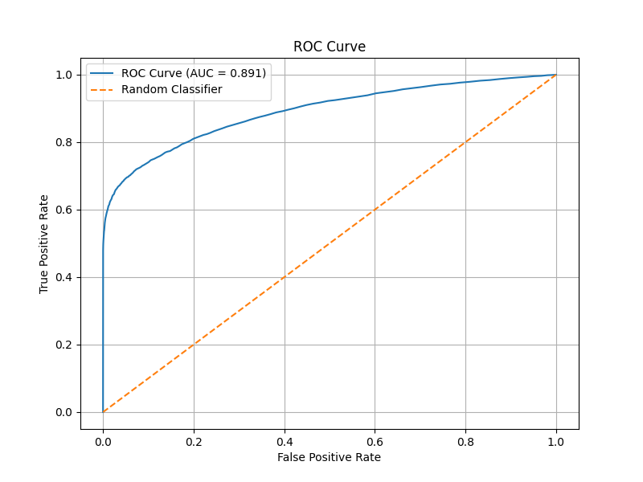
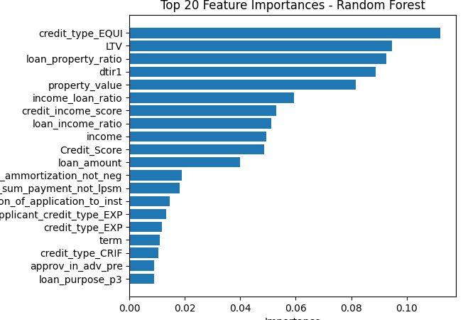

# Intelligent Loan Default Prediction Using Random Forest

## Project Overview

Financial institutions face significant challenges in managing credit risk and minimizing losses resulting from loan defaults. Traditional credit assessment methods often rely on manual reviews and limited scoring systems, which may not fully capture complex relationships among borrower characteristics, loan attributes, and repayment behavior.

This project develops a Machine Learning-based Loan Default Prediction System using a Random Forest Classifier to predict whether a borrower is likely to default on a loan. The solution supports data-driven lending decisions, risk-based pricing strategies, and portfolio risk management.

## Business Problem

Lenders need to answer a critical question before approving a loan:

> Will this borrower repay the loan or default?

Incorrect lending decisions can result in:

* Increased credit losses
* Higher provisioning costs
* Reduced profitability
* Poor portfolio quality

The objective of this project is to build a predictive model that identifies high-risk borrowers before loan approval.

## Project Objectives

* Predict loan default probability using borrower and loan characteristics.
* Identify key factors contributing to default risk.
* Support automated credit decision-making.
* Improve risk management and lending profitability

## Dataset

Source: Kaggle Loan Default Dataset

* Records: 148,670
* Features: 34
* Target Variable: Status

### Target Variable

| Status | Description |
| ------ | ----------- |
| 0      | No Default  |
| 1      | Default     |


### Key Features

#### Borrower Information

* Gender
* Age
* Income
* Credit Score
* Credit Worthiness

#### Loan Information

* Loan Amount
* Loan Type
* Loan Purpose
* Interest Rate
* Interest Rate Spread
* Term

#### Risk Indicators

* Debt-to-Income Ratio (DTI)
* Loan-to-Value Ratio (LTV)
* Credit Score
* Open Credit Lines

#### Property Information

* Property Value
* Occupancy Type
* Construction Type
* Security Type

#### Loan Information

* Loan Amount
* Loan Type
* Loan Purpose
* Interest Rate
* Interest Rate Spread
* Term

#### Risk Indicators

* Debt-to-Income Ratio (DTI)
* Loan-to-Value Ratio (LTV)
* Credit Score
* Open Credit Lines

#### Property Information

* Property Value
* Occupancy Type
* Construction Type
* Security Type

## Project Workflow

### 1. Data Preparation

* Handled missing values
* Encoded categorical variables
* Prepared numerical features
* Split data into training and testing sets

### 2. Exploratory Data Analysis (EDA)

Performed analysis to understand:

* Default distribution
* Credit score patterns
* Income characteristics
* Loan amount trends
* Risk factor relationships

### 3. Feature Engineering

Selected and transformed relevant features for modeling.

**Data leakage** in machine learning occurs when information
from outside the training dataset (such as the test set or future data) is
unintentionally used to train the model.

*To avoid data leakage problem splitting the data into train and test was done prior to data processing*

### 4. Model Development

Random Forest Classifier was selected due to its ability to:

* Handle nonlinear relationships
* Capture complex interactions
* Reduce overfitting through ensemble learning
* Provide feature importance scores

Model configuration:

```
RandomForestClassifier(
    n_estimators=300,
    random_state=42,
    class_weight='balanced',
    n_jobs=-1
)
```


### 5. Model Evaluation

Evaluation metrics used:

* Accuracy
* Precision
* Recall
* F1 Score
* ROC-AUC Score
* Confusion Matrix

## Results

The Random Forest model successfully identified borrowers with a high probability of default.

Key evaluation metrics include:

* Accuracy
  `0.8940`
* Precision
  `0.9492`
* Recall
  `0.6022`
* F1 Score
  `0.7369`
* ROC-AUC

  


## Feature Importance Analysis

The model identifies the most influential variables contributing to default prediction.

Typical high-impact features include:

* Credit Score
* Debt-to-Income Ratio (DTI)
* Loan-to-Value Ratio (LTV)
* Income
* Interest Rate Spread
* Loan Amount
* Property Value

Feature importance analysis helps credit risk teams understand the drivers of borrower risk.



---

## Business Impact

This solution can be integrated into a loan origination system to:

### Automated Loan Screening

* Approve low-risk applicants
* Flag medium-risk applicants for review
* Reject high-risk applicants

## Business Impact

This solution can be integrated into a loan origination system to:

### Automated Loan Screening

* Approve low-risk applicants
* Flag medium-risk applicants for review
* Reject high-risk applicants

### Risk-Based Pricing

Assign interest rates based on predicted default risk.

### Portfolio Monitoring

Identify concentrations of risk across regions, loan types, and borrower segments.

### Expected Benefits

* Reduced loan defaults
* Improved portfolio quality
* Faster approval decisions
* Increased lending profitability

---

## Technology Stack

* Python
* Pandas
* NumPy
* Scikit-learn
* Matplotlib
* Visual Studio Code

## Repository Structure

|   Random_Forest.py
|   README.md
|
+---.idea
|   |   .gitignore
|   |   misc.xml
|   |   modules.xml
|   |   Random Forest Model.iml
|   |   vcs.xml
|   |   workspace.xml
|   |
|   \---inspectionProfiles
|           profiles_settings.xml
|           Project_Default.xml
|
+---data
|       Loan_Default.csv
|
\---images
        Confusion_Matrix.png
        Feature_Importance.png
        ROC_CURVE.png


## Future Improvements

* Hyperparameter tuning using GridSearchCV
* XGBoost and LightGBM comparison
* SHAP explainability analysis
* Deployment using Streamlit
* Real-time loan risk scoring API

---

## Author

Moses Kamau Chege

Data Scientist | Data Analyst | Machine Learning Enthusiast

LinkedIn: https://www.linkedin.com/in/moses-chege/

GitHub: https://github.com/thugge254
